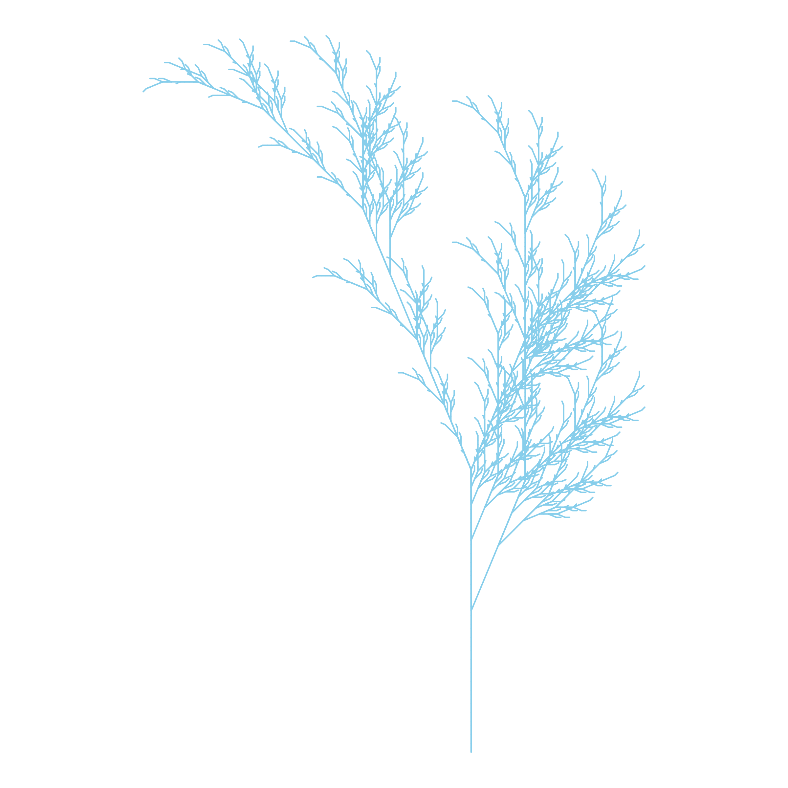

## EPPS 6356 — Data Visualization

### Assignment 1

#### 1. Anscombe's Quartet

The main idea is the lack of attention that statistical textbooks and software pay to graphics.

Three red flags:

- It is wrong to assume that numeric calculations are correct and graphs are the "weird" part.
- There is not one single way to analyze the data.
- There is no virtue in just taking into account the calculus.

Given that:

- Before every calculation, provide the scatterplot.
- Plot the residuals against the adjusted (fitted) values after the regression.
- Outlier — always investigate. Is it an error? Report it.
- If the curves suggest non-linearity, consider transformations.

#### 2. Fall Color

The default color was replaced with a custom sky-blue tone (`skyblue`).

#### 3. Critique of a Published Chart

In April 2014, Reuters published a graphic on the number of gun deaths in Florida, with the "Stand Your Ground" law (2005) as the turning point. However, the Y-axis was inverted, which conveyed a decrease in the numbers when the opposite was true. The numbers were not wrong — the form was. The solution is simple: keep the Y-axis in its conventional position.

*Source: ["How to Mislead With Charts" — Pacific Standard](https://psmag.com/news/mislead-charts-stand-ground-laws-gun-deaths-79726/)*